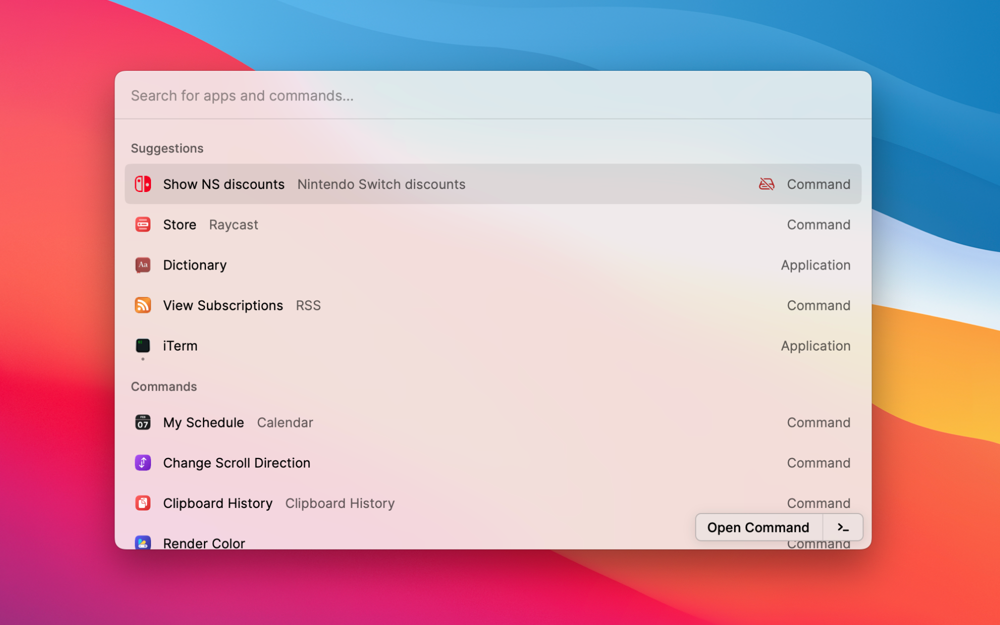
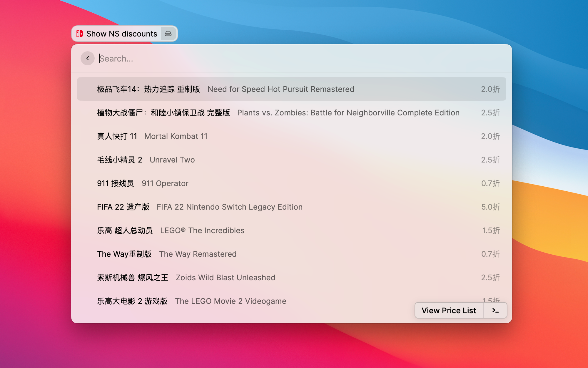
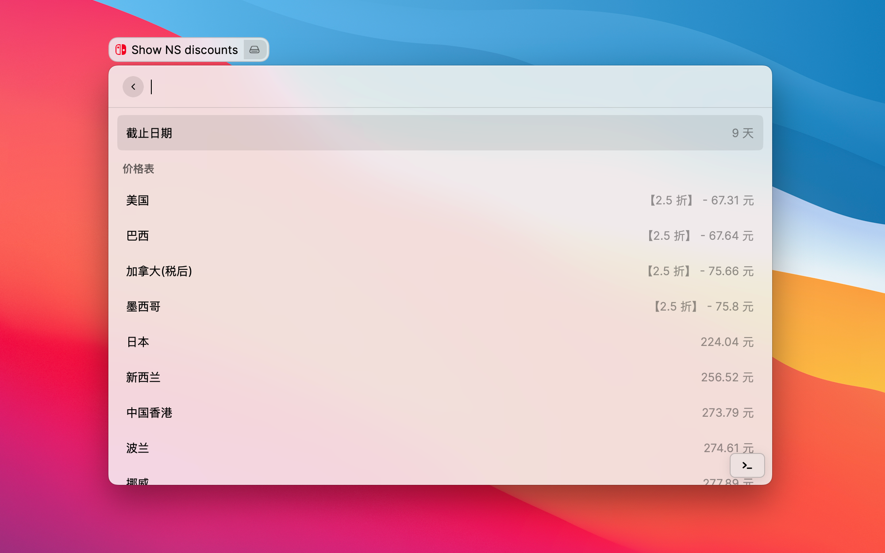

# [WIP] NS Discount

Show the latest discount of the games on Nintendo Switch

## Screenshot





## Prerequisite

1. [Raycast](https://www.raycast.com/) installed definitely
2. Node.js Enviroment

## Usage
> Due to the lack of English ver. API, it can't be published to the Raycast Store now. So you can clone the repo and install it locally.

1. Clone the repo to your computer
2. Install Dependencies
   ```shell
   $ npm install
   ```
3. Build the Plugin
   ```shell
   $ npm run build
   ```

## Credit

Inspired By [vscode-ns-discount](https://github.com/PatrickSR/vscode-ns-discount)